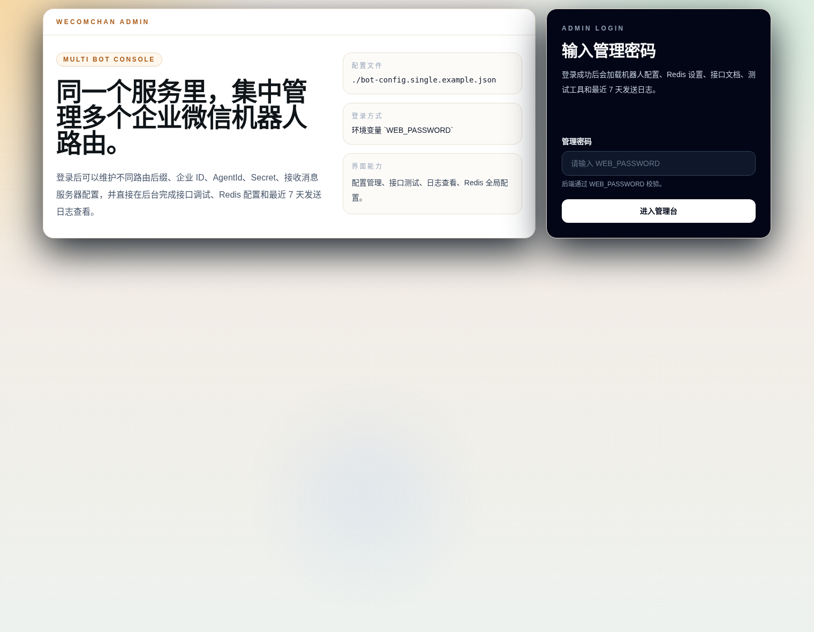
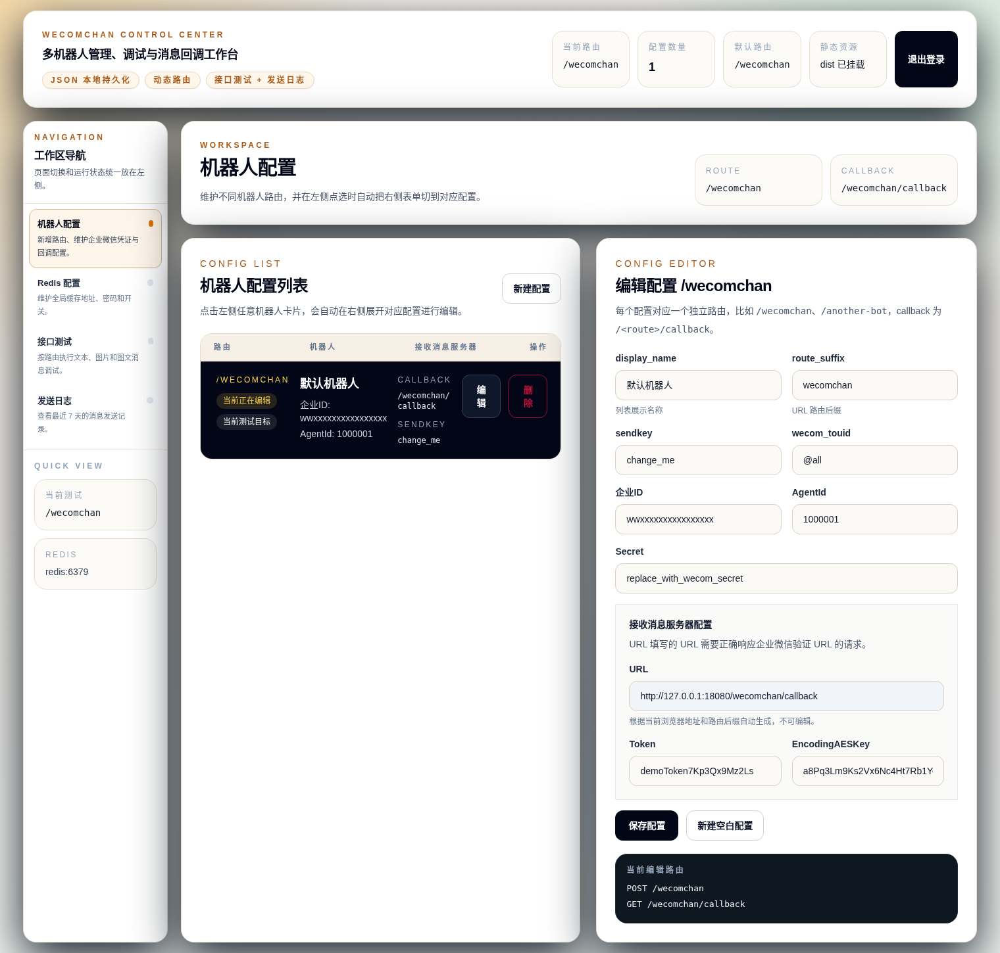
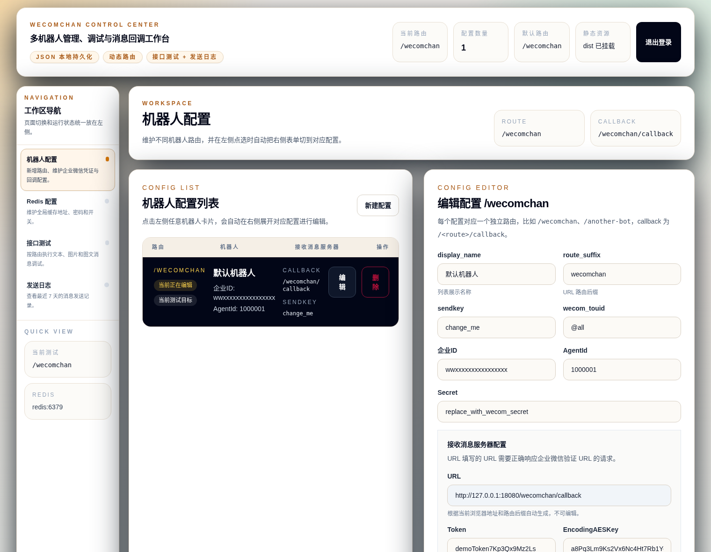
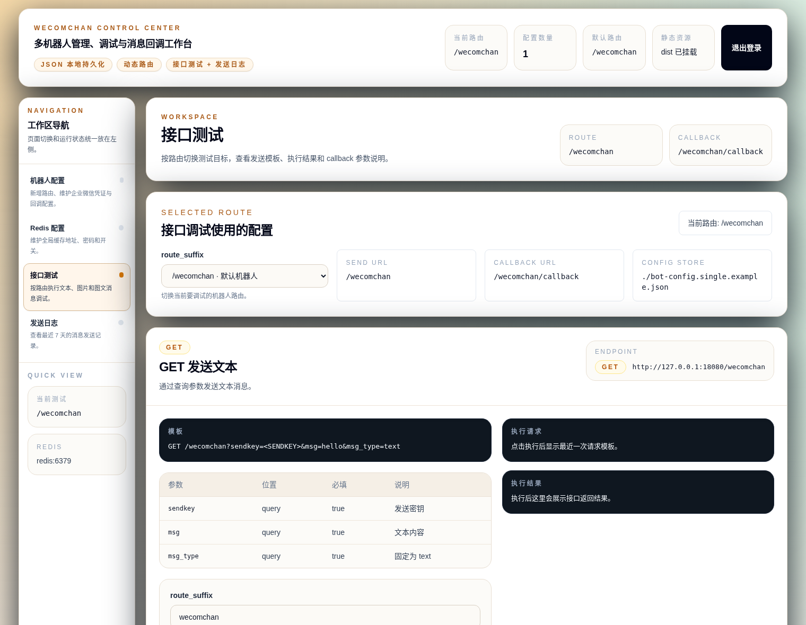

# go-wecomchan

一个带 Web 管理界面的企业微信消息服务。

第一次使用，直接按下面 5 步做就够了。

## 1. 启动 `sola97/wecomchan-next + redis + nginx`

先执行：

```bash
mkdir -p conf.d
```

再新建 `conf.d/wecomchan.conf`：

```nginx
server {
  listen 80;
  server_name <修改成你的域名>;

  location / {
    proxy_pass http://wecomchan:8080;
    proxy_http_version 1.1;
    proxy_set_header Host $host;
    proxy_set_header X-Real-IP $remote_addr;
    proxy_set_header X-Forwarded-For $proxy_add_x_forwarded_for;
    proxy_set_header X-Forwarded-Proto $scheme;
  }
}
```

再新建 `docker-compose.yml`：

```yaml
services:
  wecomchan:
    image: sola97/wecomchan-next:latest
    container_name: wecomchan-next
    restart: always
    environment:
      WEB_PASSWORD: "<修改成你的密码>"
    volumes:
      - ./data:/root/data
    depends_on:
      - redis
    logging:
      driver: json-file
      options:
        max-size: 10m
        max-file: "1"

  redis:
    image: redis:7-alpine
    container_name: wecomchan-next-redis
    restart: always
    command: ["redis-server", "--appendonly", "yes"]
    volumes:
      - redis_data:/data
    logging:
      driver: json-file
      options:
        max-size: 10m
        max-file: "1"

  nginx:
    image: nginx:alpine
    container_name: wecomchan-next-nginx
    restart: always
    depends_on:
      - wecomchan
    ports:
      - "8080:80"
      - "8443:80"
    volumes:
      - ./conf.d:/etc/nginx/conf.d:ro
    logging:
      driver: json-file
      options:
        max-size: 30m
        max-file: "1"

volumes:
  redis_data:
```

把上面 `<修改成你的密码>` 改掉。
把 `conf.d/wecomchan.conf` 里的域名改成你自己的。

`bot-configs.json` 不用手工创建。服务会先正常启动，第一次在后台保存配置时自动写入 `./data/bot-configs.json`。

启动：

```bash
docker compose up -d
```

启动后访问：

- `http://<服务器IP>:8080/admin/`
- `http://<你的域名>:8443/admin/`

### 登录页



## 2. 进入后台，新建机器人配置

登录后台后：

1. 点击“新建配置”
2. 填入机器人配置
3. 点击“保存配置”

保存后，左侧列表会出现这一个机器人。

### 单机器人配置页



## 3. 先去企业微信后台，打开“接收消息服务器配置”

先进入企业微信应用后台的“接收消息服务器配置”页面。

这一步先准备好：

- `Token`
- `EncodingAESKey`

## 4. 回到网页填写，再回企业微信保存

回到网页里的“接收消息服务器配置”区块：

- 把企业微信页面里的 `Token` 填进网页
- 把企业微信页面里的 `EncodingAESKey` 填进网页
- 点击保存
- `URL` 直接用网页展示出来的地址

然后再回到企业微信后台，只填 `URL` 并保存。

建议直接用最终域名访问管理界面，再去复制这组配置。

### 接收消息服务器配置



## 5. 企业微信保存成功后，再设置可信 IP 和接口测试

企业微信里的“接收消息服务器配置”保存成功后：

1. 设置可信 IP
2. 回到网页里的“接口测试”页面发一条测试消息

接口模板、参数说明、执行按钮、执行结果，网页端都已经有了，README 不再重复写。

### 接口测试页



## 说明

- 配置会保存到 `./data/bot-configs.json`
- 如果只是第一次上线，优先走单机器人流程
- 接口说明、回调地址、执行结果都以网页端为准
